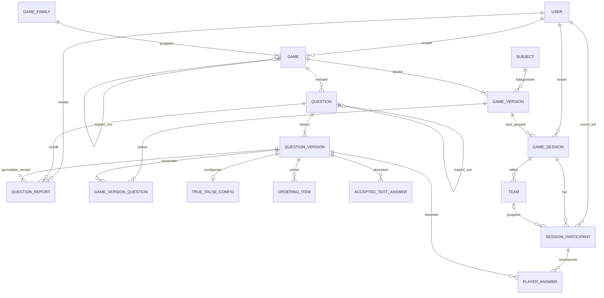

# Datenmodell Version 1

Stand: 23. September 2026
Status: Fachlicher Entwurf, noch nicht implementiert

Die vier Fragerunden mit Davids Antworten, späteren Korrekturen und den noch
offenen Detailfragen sind in
[`datenmodell-entscheidungen.md`](datenmodell-entscheidungen.md) dokumentiert.

Eine eigenständige, renderbare PlantUML-Darstellung liegt in
[`datenmodell-v1.puml`](datenmodell-v1.puml). Eine zusätzliche Mermaid-Fassung
liegt in [`datenmodellGrafik.md`](datenmodellGrafik.md).

## 1. Ziel und Abgrenzung

Dieses Dokument beschreibt die erste fachliche Version des Datenmodells für die
Game-based-Learning-Plattform. Es bildet Benutzer, Spiele und Spielvarianten,
versionierte Fragen, Einzel- und Mehrspieler-Sessions, Antworten, Ergebnisse,
Fortschritt sowie Meldungen zu fehlerhaften Fragen ab.

Das Modell ist noch keine Datenbankmigration. Vor der Implementierung müssen
Tabellen- und Spaltennamen sowie die genaue Abbildung in JPA festgelegt werden.

## 2. Bestätigte Fachentscheidungen

- Die aktuelle Schulklasse eines Schülers wird beim Login aus einem Claim des
  Schul-Keycloak-Tokens übernommen.
- Jede Lehrkraft darf alle aktuellen Klassen und deren Schüler einsehen.
- Spiele werden genau einem Fach zugeordnet. Unterthemen werden über Titel,
  Beschreibung und Textsuche gefunden.
- Spiele sind entweder `PRIVATE` oder `PUBLIC`.
- Die öffentliche Spieleliste und Spieldetails sind nur nach einem Login
  zugänglich.
- Neue Spiele sind standardmäßig `PRIVATE`. Bereits vorhandene Spiele werden
  bei der Migration als `PUBLIC` übernommen.
- Nur der Ersteller oder ein Administrator darf ein Spiel bearbeiten oder
  löschen.
- Lehrkräfte und Administratoren dürfen Spiele erstellen, kopieren und Fragen
  melden.
- Schüler und Lehrkräfte dürfen öffentliche Spiele hosten. Schüler dürfen
  öffentliche Spiele außerdem alleine spielen.
- Die Ersteller-Lehrkraft darf das eigene private Spiel alleine und gemeinsam
  mit Schülern hosten.
- Lehrkräfte dürfen alleine spielen und erhalten dafür Fortschritt. Ihre
  Teilnahme an Mehrspieler-Sessions ist noch nicht entschieden.
- Administratoren dürfen im Kontext der Spielrechte alles, einschließlich des
  Zugriffs auf fremde und private Spiele.
- Eine Spielkopie ist eine eigenständige Variante und bleibt über eine
  Spielfamilie mit dem Original verbunden.
- Kopierte Fragen werden als neue, unabhängige Fragen gespeichert. Meldungen
  werden nicht auf Kopien übertragen.
- Unterstützte Fragetypen sind Wahr/Falsch, Reihenfolge und Freitext.
- Jede gestartete Spielrunde wird als Session gespeichert.
- Ergebnisse werden auch bei Teamspielen pro Spieler gespeichert.
- Bei einem Gleichstand erhalten mehrere Teams den besseren Platz; der nächste
  Platz wird übersprungen, zum Beispiel `1, 1, 3`.
- Wiederholungen geben immer die volle Punktezahl. Es gibt keinen
  Anti-Farming-Abzug.
- Singleplayer- und Multiplayer-Statistiken werden getrennt angezeigt, fließen
  aber in ein gemeinsames Gesamtlevel ein.
- Klassenstatistiken werden aus den aktuell zugeordneten Schülern berechnet.
- Änderungen gelten sofort für neue Sessions. Bereits laufende Sessions spielen
  mit der beim Start verwendeten Version fertig.
- Bereits verwendete Spiel- und Frageversionen bleiben für historische
  Ergebnisse erhalten.
- Wird eine gemeldete Frage gelöscht, werden die Frage und ihre Meldung
  gelöscht. Die technische Vereinbarkeit mit den aufzubewahrenden historischen
  Session- und Antwortdaten ist noch festzulegen.

## 3. Rollen und Berechtigungen

Alle in der Tabelle genannten Ansichten setzen einen Login voraus.

| Aktion | Schüler | Lehrkraft | Administrator |
|---|:---:|:---:|:---:|
| Öffentliche Spieleliste und Spieldetails sehen | Ja | Ja | Ja |
| Öffentliches Spiel alleine spielen | Ja | Ja | Ja |
| Öffentliches Spiel hosten | Ja | Ja | Ja |
| Eigenes privates Spiel alleine spielen | – | Ja | Ja |
| Eigenes privates Spiel mit Schülern hosten | – | Ja | Ja |
| Spiel erstellen | Nein | Ja | Ja |
| Öffentliches Spiel kopieren | Nein | Ja | Ja |
| Eigenes Spiel bearbeiten und löschen | Nein | Ja | Ja |
| Fremdes oder privates Spiel administrieren | Nein | Nein | Ja |
| Frage melden | Nein | Ja | Ja |
| Klassen und Schüler einsehen | Nein | Ja | Nicht entschieden |

Das bestätigte uneingeschränkte Administratorrecht gilt für den
Spielkontext. Rechte außerhalb dieses Kontexts, beispielsweise der Zugriff auf
Klassen- und Schülerdaten, werden daraus nicht abgeleitet. Ebenfalls offen ist,
wie eingeladene Schüler einer privaten Runde beitreten und welche Spieldetails
sie dabei sehen. Daraus entsteht kein allgemeiner Zugriff auf private Spiele.

## 4. Beziehungen im Überblick



## 5. Benutzer, Klassen und Fächer

### `users`

| Feld | Typidee | Regeln |
|---|---|---|
| `id` | UUID | Primärschlüssel |
| `external_subject` | VARCHAR | Eindeutige Keycloak-Subject-ID |
| `username` | VARCHAR | Eindeutig innerhalb der Plattform |
| `display_name` | VARCHAR | Anzeigename |
| `role` | ENUM | `STUDENT`, `TEACHER`, `ADMIN` |
| `current_class_code` | VARCHAR, NULL | Aktuelle Klasse, nur für Schüler relevant |
| `active` | BOOLEAN | Deaktivierte Benutzer dürfen keine geschützten Aktionen ausführen |
| `created_at` | TIMESTAMP | Erstellungszeitpunkt |
| `updated_at` | TIMESTAMP | Letzte Profilaktualisierung |

Die aktuelle Klasse wird bei jedem authentifizierten Profilabgleich aus dem
Keycloak-Claim aktualisiert. Eine eigene Klassentabelle ist für Version 1 nicht
notwendig. Eine Klasse ergibt sich aus allen aktiven Schülern mit demselben
`current_class_code`.

Folge: Wechselt ein Schüler die Klasse, werden seine persönlichen Ergebnisse
künftig in der Statistik der neuen Klasse berücksichtigt. Historische
Klassenstände werden in Version 1 nicht rekonstruiert.

### `subjects`

| Feld | Typidee | Regeln |
|---|---|---|
| `id` | UUID | Primärschlüssel |
| `name` | VARCHAR | Eindeutiger Fachname |
| `short_name` | VARCHAR, NULL | Optionales Kürzel |
| `active` | BOOLEAN | Inaktive Fächer können nicht neu zugeordnet werden |

## 6. Spiele, Spielfamilien und Versionen

### `game_families`

| Feld | Typidee | Regeln |
|---|---|---|
| `id` | UUID | Primärschlüssel |
| `created_at` | TIMESTAMP | Erstellungszeitpunkt |

Eine Spielfamilie gruppiert das Original und alle daraus entstandenen Varianten.
Die Bibliothek zeigt eine Familie als gemeinsamen Eintrag und darunter die für
den Benutzer sichtbaren Varianten.

### `games`

| Feld | Typidee | Regeln |
|---|---|---|
| `id` | UUID | Primärschlüssel |
| `family_id` | UUID | Pflicht-FK auf `game_families` |
| `copied_from_game_id` | UUID, NULL | Direkte Vorlage der Kopie |
| `creator_user_id` | UUID, NULL | Bei Neuanlagen Pflicht-FK auf eine Lehrkraft oder einen Administrator; nur für besitzerlose Altspiele vorübergehend `NULL` |
| `visibility` | ENUM | `PRIVATE` oder `PUBLIC`; bei Neuanlage standardmäßig `PRIVATE` |
| `current_version_id` | UUID | Aktuell für neue Sessions verwendete Version |
| `deleted_at` | TIMESTAMP, NULL | Logisches Löschen, sobald historische Daten existieren |
| `created_at` | TIMESTAMP | Erstellungszeitpunkt |
| `updated_at` | TIMESTAMP | Letzte Änderung |

Nur der in `creator_user_id` gespeicherte Benutzer oder ein Administrator darf
das Spiel verändern. Ein besitzerloses Altspiel mit `creator_user_id = NULL`
wird bei der Migration niemandem automatisch zugeordnet und darf nur von einem
Administrator verwaltet werden. Beim Kopieren entsteht ein neues
`games`-Objekt mit neuem Ersteller, aber derselben `family_id`. Kopiert wird
immer die zum Zeitpunkt des Kopierens aktuelle Version.

Die Standardbelegung `PRIVATE` gilt für neu erstellte Spiele. Als eigene
Migrationsregel werden alle bereits vor Einführung dieser Sichtbarkeit
vorhandenen Spiele einmalig als `PUBLIC` übernommen. Diese Regel ist keine
allgemeine Datenbankvorgabe für spätere Neuanlagen.

Listen- und Detailzugriffe auf öffentliche Spiele erfordern einen
authentifizierten Benutzer. Private Spiele bleiben in der Bibliothek auf ihren
Ersteller und Administratoren beschränkt. Für Schüler, die an einer von der
Ersteller-Lehrkraft gehosteten privaten Runde teilnehmen, ist ein gesonderter
Zugangsweg erforderlich; dessen Ausgestaltung und der dabei sichtbare Umfang
der Spieldetails sind noch nicht entschieden.

### `game_versions`

| Feld | Typidee | Regeln |
|---|---|---|
| `id` | UUID | Primärschlüssel |
| `game_id` | UUID | Pflicht-FK auf `games` |
| `version_number` | INTEGER | Pro Spiel eindeutig und aufsteigend |
| `title` | VARCHAR | Titel dieser Version |
| `description` | TEXT | Beschreibung dieser Version |
| `game_mode` | VARCHAR/ENUM | Konkreter Spielmodus |
| `subject_id` | UUID | Fach zum Zeitpunkt dieser Version |
| `created_at` | TIMESTAMP | Versionszeitpunkt |

Versionen sind nach ihrer Erstellung unveränderlich. Eine Bearbeitung erzeugt
sofort eine neue Version und setzt `games.current_version_id` auf diese Version.
Neue Sessions verwenden die neue Version; laufende und historische Sessions
behalten ihren bisherigen Verweis.

### Atomarer Versionswechsel

Jede Änderung am sichtbaren Spielinhalt wird in einer Datenbanktransaktion als
vollständiger neuer Snapshot gespeichert. Das gilt auch für das Hinzufügen,
Bearbeiten, Entfernen oder Umordnen einer Frage:

1. Für jede geänderte Frage wird eine neue `question_version` erzeugt.
2. Unveränderte Fragen dürfen ihre bestehende `question_version` weiterverwenden.
3. Eine neue `game_version` wird angelegt.
4. `game_version_questions` erhält die vollständige Fragenreihenfolge des neuen
   Snapshots.
5. Erst danach werden `games.current_version_id` und die betroffenen
   `questions.current_version_id` atomar auf den neuen Stand gesetzt.

Schlägt einer dieser Schritte fehl, bleibt die vorherige aktuelle Spielversion
unverändert. Dadurch erhalten neue Sessions niemals einen gemischten Stand aus
alter Spiel- und neuer Frageversion.

## 7. Fragen und Antwortmodelle

### `questions`

| Feld | Typidee | Regeln |
|---|---|---|
| `id` | UUID | Primärschlüssel |
| `game_id` | UUID | Pflicht-FK auf `games` |
| `copied_from_question_id` | UUID, NULL | Dokumentiert nur die Herkunft |
| `current_version_id` | UUID | Aktuelle Frageversion |
| `deleted_at` | TIMESTAMP, NULL | Aus neuen Versionen entfernt |
| `created_at` | TIMESTAMP | Erstellungszeitpunkt |

Eine kopierte Frage ist nach dem Kopieren vollständig unabhängig. Änderungen
und Meldungen der Vorlage wirken sich nicht auf die Kopie aus.

### `question_versions`

| Feld | Typidee | Regeln |
|---|---|---|
| `id` | UUID | Primärschlüssel |
| `question_id` | UUID | Pflicht-FK auf `questions` |
| `version_number` | INTEGER | Pro Frage eindeutig und aufsteigend |
| `type` | ENUM | `TRUE_FALSE`, `ORDERING`, `FREE_TEXT` |
| `text` | TEXT | Fragetext |
| `created_at` | TIMESTAMP | Versionszeitpunkt |

### `game_version_questions`

| Feld | Typidee | Regeln |
|---|---|---|
| `game_version_id` | UUID | Teil des zusammengesetzten Schlüssels |
| `question_version_id` | UUID | Teil des zusammengesetzten Schlüssels |
| `position` | INTEGER | Eindeutige Reihenfolge innerhalb der Spielversion |

### Fragetyp-spezifische Tabellen

`true_false_configs`

- `question_version_id` als Primär- und Fremdschlüssel
- `correct_value` als Boolean

`ordering_items`

- `id`
- `question_version_id`
- `text`
- `correct_position`

`accepted_text_answers`

- `id`
- `question_version_id`
- `answer`

Bestätigt ist eine exakte Freitextbewertung mit internen Vergleichsregeln, die
Groß- und Kleinschreibung ignorieren. Weitere Toleranzen wurden nicht
festgelegt. Die folgende Normalisierung ist deshalb ein technischer
Entwurfsvorschlag; nur die Fallunterscheidung in Schritt 2 ist fachlich
bestätigt:

1. Leerzeichen am Anfang und Ende entfernen;
2. Groß- und Kleinschreibung ignorieren;
3. mehrere aufeinanderfolgende Leerzeichen zusammenfassen;
4. exakte Übereinstimmung mit mindestens einer Musterlösung verlangen.

## 8. Sessions, Teams und Teilnehmer

### `game_sessions`

| Feld | Typidee | Regeln |
|---|---|---|
| `id` | UUID | Primärschlüssel |
| `game_id` | UUID | Identität des gespielten Spiels |
| `game_version_id` | UUID | Unveränderliche Version dieser Session |
| `host_user_id` | UUID | Schüler, Lehrkraft oder Administrator |
| `mode` | ENUM | `SINGLEPLAYER` oder `MULTIPLAYER` |
| `join_code` | VARCHAR, NULL | Nur für Multiplayer, während aktiver Lobby eindeutig |
| `status` | ENUM | `LOBBY`, `RUNNING`, `FINISHED`, `CANCELLED` |
| `started_at` | TIMESTAMP, NULL | Spielstart |
| `finished_at` | TIMESTAMP, NULL | Spielende |
| `created_at` | TIMESTAMP | Erstellung der Session |

Host und Teilnehmer sind getrennte Konzepte. Ein Schüler kann gleichzeitig Host
und Teilnehmer sein. Eine Lehrkraft wird beim Singleplayer als Teilnehmer
gespeichert und erhält daraus Fortschritt. Ob eine Lehrkraft auch als Teilnehmer
einer Mehrspieler-Session gespeichert werden darf, ist noch nicht entschieden;
ihre bestätigte Rolle als Host beantwortet diese Frage nicht.

Ein Administrator darf Singleplayer spielen und wird dafür als Teilnehmer der
Session gespeichert. Ob dieses Ergebnis auch in seinen dauerhaften Fortschritt
und sein Level einfließt, wurde nicht entschieden. Das Spielrecht allein legt
keine Fortschrittsregel fest.

Die Ersteller-Lehrkraft darf ihr eigenes privates Spiel als Singleplayer-Session
starten oder als Mehrspieler-Session mit Schülern hosten. Welche Autorisierung
beziehungsweise Einladung den teilnehmenden Schülern Zugriff auf diese private
Session gibt, ist vor der Implementierung festzulegen.

### `teams`

| Feld | Typidee | Regeln |
|---|---|---|
| `id` | UUID | Primärschlüssel |
| `session_id` | UUID | Pflicht-FK auf `game_sessions` |
| `name` | VARCHAR | Innerhalb der Session eindeutig |
| `color` | VARCHAR, NULL | Darstellungsinformation |
| `score` | INTEGER | Vom Spielmodus berechnete Teampunkte |
| `placement` | INTEGER, NULL | Endplatzierung |

### `session_participants`

| Feld | Typidee | Regeln |
|---|---|---|
| `id` | UUID | Primärschlüssel |
| `session_id` | UUID | Pflicht-FK auf `game_sessions` |
| `user_id` | UUID | Pflicht-FK auf `users` |
| `team_id` | UUID, NULL | Nur bei Teamspielen |
| `score` | INTEGER | Individuell zugeordnete Punkte |
| `placement` | INTEGER, NULL | Individuelle Endplatzierung |
| `winner` | BOOLEAN | Mitglied eines Siegerteams beziehungsweise Einzelsieger |
| `completed` | BOOLEAN | Regulär abgeschlossen |
| `joined_at` | TIMESTAMP | Beitrittszeitpunkt |

Pro Session darf ein Benutzer höchstens einmal Teilnehmer sein. Bei einem
Teamspiel erhalten alle Mitglieder des Siegerteams `winner = true`. Gleichstand
wird als Competition Ranking gespeichert, beispielsweise `1, 1, 3`.

## 9. Antworten und Bewertung

### `player_answers`

| Feld | Typidee | Regeln |
|---|---|---|
| `id` | UUID | Primärschlüssel |
| `participant_id` | UUID | Pflicht-FK auf `session_participants` |
| `question_version_id` | UUID | Tatsächlich beantwortete Version |
| `answer_data` | JSON/TEXT | Typabhängige abgegebene Antwort |
| `correct` | BOOLEAN | Bewertung zum Spielzeitpunkt |
| `score` | INTEGER | Vom Spielmodus berechnete Punkte |
| `response_time_ms` | BIGINT, NULL | Optionale Antwortdauer |
| `answered_at` | TIMESTAMP | Abgabezeitpunkt |

Die abgegebene Antwort und das damalige Bewertungsergebnis werden beide
gespeichert. Dadurch verändern spätere Anpassungen an Fragen oder
Bewertungsalgorithmen keine historischen Ergebnisse.

In Version 1 darf ein Teilnehmer jede Frage einer Spielversion höchstens einmal
beantworten. Deshalb ist `(participant_id, question_version_id)` eindeutig.
Benötigt ein späterer Spielmodus mehrere Versuche derselben Frage, muss dafür
eine eigene Session-Frageinstanz ergänzt werden.

`player_answers.score` dokumentiert ausschließlich die Punkte dieser Antwort.
`teams.score` bestimmt die Teamplatzierung. Die verbindliche Quelle für den dem
Benutzer gutgeschriebenen Gesamtwert ist nach Abschluss der Session
`session_participants.score`. Dieser Wert wird genau einmal vom Spielmodus
finalisiert und für Fortschritt und Level verwendet; Team- und Antwortpunkte
werden bei Statistiken nicht zusätzlich addiert.

## 10. Fortschritt, Punkte und Level

Die Quelle für den Fortschritt sind abgeschlossene `session_participants` und
deren `player_answers`. Dazu gehören Schüler sowie Lehrkräfte im Singleplayer.
Ob Lehrkräfte auch aus Mehrspieler-Sessions Fortschritt erhalten, ist noch
nicht entschieden. Administratoren dürfen Singleplayer spielen; ob ihre
Teilnahme für Fortschritt und Level ausgewertet wird, ist ebenfalls noch offen.
In Version 1 ist keine zusätzliche dauerhaft gepflegte Fortschrittstabelle
notwendig.

Berechnet werden mindestens:

- Anzahl gespielter Singleplayer-Sessions;
- Anzahl gespielter Multiplayer-Sessions;
- Anzahl gewonnener Multiplayer-Sessions;
- Singleplayer-Punkte;
- Multiplayer-Punkte;
- Gesamtpunkte;
- Ergebnisse und Trefferquote pro Fach.

```text
Gesamtpunkte = Singleplayer-Punkte + Multiplayer-Punkte
Gesamtlevel  = Level-Funktion(Gesamtpunkte)
```

Wiederholungen zählen immer vollständig. Die konkrete Levelkurve ist noch
festzulegen. Falls die Berechnungen später zu teuer werden, kann eine technische
Projektion beziehungsweise Cache-Tabelle ergänzt werden; sie ist nicht die
fachliche Quelle der Ergebnisse.

Eine Klassenstatistik wird zur Laufzeit aus den persönlichen Ergebnissen aller
aktiven Schüler mit dem aktuell passenden `current_class_code` berechnet.

## 11. Meldungen zu Fragen

Fachlich bestätigt sind Meldungen durch Lehrkräfte mit Kommentar, die
Kennzeichnung gemeldeter Fragen, das Nichtübertragen einer Meldung auf eine
Fragenkopie sowie das Löschen der Meldung zusammen mit der gemeldeten Frage.
Administratoren dürfen aufgrund ihrer bestätigten umfassenden Spielrechte
ebenfalls melden und Meldungen verwalten. Empfänger, Statusfolge,
Bearbeitungszuständigkeit und Abschlussnotizen wurden nicht fachlich
festgelegt. Die entsprechenden Felder und Abläufe unten sind ein technischer
Entwurfsvorschlag.

### `question_reports`

| Feld | Typidee | Regeln |
|---|---|---|
| `id` | UUID | Primärschlüssel |
| `question_id` | UUID | Konkrete gemeldete Frage |
| `question_version_id` | UUID | Beim Melden sichtbare Version |
| `reporter_user_id` | UUID | Lehrkraft oder Administrator |
| `comment` | TEXT | Pflichtfeld |
| `status` | ENUM | Vorschlag: `OPEN`, `IN_REVIEW`, `RESOLVED`, `REJECTED` |
| `resolution_comment` | TEXT, NULL | Vorgeschlagene optionale Bearbeitungsnotiz |
| `resolved_by_user_id` | UUID, NULL | Vorgeschlagener Bearbeiter: Ersteller-Lehrkraft oder Administrator |
| `created_at` | TIMESTAMP | Meldezeitpunkt |
| `resolved_at` | TIMESTAMP, NULL | Abschlusszeitpunkt |

Die Meldung gilt nur für die konkrete Frage und wird beim Kopieren nicht
übernommen. Der Verweis auf `question_version_id` bewahrt den tatsächlich
gemeldeten Stand. Dass die Meldung dem Ersteller des betroffenen Spiels
angezeigt wird, ist ein Entwurfsvorschlag und noch keine bestätigte
Empfängerregel.

Als technischer Entwurf ist vorgesehen, dass der Ersteller des betroffenen
Spiels oder ein Administrator eine Meldung bearbeitet: von `OPEN` über
`IN_REVIEW` zu `RESOLVED` oder `REJECTED`, ohne direkte Wechsel zwischen
abgeschlossenen Zuständen. Dieser Workflow ist vor der Implementierung noch
fachlich zu bestätigen.

Wird die gemeldete Frage gelöscht, wird auch die zugehörige Meldung gelöscht.
Sie bleibt danach weder als offene noch als abgeschlossene Meldung erhalten.

## 12. Löschen und Aufbewahrung

Für den Benutzer wirkt Löschen unmittelbar: Der Inhalt verschwindet aus
Bibliothek, Editor und neuen Sessions.

- Noch nie verwendete und nie kopierte Spiele und Fragen können physisch
  gelöscht werden.
- Beim Löschen einer gemeldeten Frage werden die aktive Frage und ihre
  zugehörigen Meldungen gelöscht.
- Sobald eine Version von einer Session verwendet wird, bleiben die benötigten
  `game_versions` und `question_versions` erhalten.
- Sobald ein Spiel als Kopiervorlage verwendet wurde, bleibt seine Identität
  für die Herkunftskette erhalten und wird über `games.deleted_at` logisch
  gelöscht.
- Wie die Herkunftskette einer kopierten Frage nach dem bestätigten Löschen
  der Ausgangsfrage erhalten bleibt, ist Teil der noch offenen technischen
  Ausgestaltung. Das bisher vorgeschlagene `questions.deleted_at` darf nicht
  stillschweigend als fachlich bestätigte Löschregel behandelt werden.
- Historische Sessions, Antworten und Ergebnisse bleiben nachvollziehbar.
- Eine gelöschte Vorlage darf nicht mehr kopiert oder neu gestartet werden.

Zwischen der bestätigten Löschung einer gemeldeten Frage und der Aufbewahrung
historischer Antworten besteht ein technischer Konflikt: `player_answers`
verweist auf die damals verwendete `question_version`, und im aktuellen Entwurf
verweist diese Version wiederum auf `questions`. Vor der Implementierung muss
daher festgelegt werden, ob die historische Version von der aktiven Frage
entkoppelt, die aktive Frage nur logisch entfernt oder das Referenzmodell anders
aufgebaut wird. Das ist ein technischer Vorschlagspunkt und keine bereits
bestätigte fachliche Löschregel. Unabhängig von dieser Ausgestaltung darf die
zugehörige Fragenmeldung nach dem Löschen nicht erhalten oder angezeigt werden.

## 13. Zentrale Integritätsregeln

1. `creator_user_id` eines neu erstellten Spiels verweist auf eine Lehrkraft
   oder einen Administrator. Nur ein besitzerloses Altspiel darf während der
   Migration `creator_user_id = NULL` behalten; es wird niemandem automatisch
   zugeordnet.
2. Nur der Ersteller oder ein Administrator darf ein Spiel oder seine Fragen
   verändern und löschen. Ein besitzerloses Altspiel darf ausschließlich ein
   Administrator verwalten.
3. Fremde Spiele können nur kopiert werden, wenn sie `PUBLIC` sind.
4. Alle Spiele einer Variantenkette besitzen dieselbe `family_id`.
5. Eine Kopie erhält neue Spiel-, Frage- und Versions-IDs.
6. `GameVersion` und `QuestionVersion` sind nach Erstellung unveränderlich.
7. Eine Session behält ihre `game_version_id` bis zum Ende.
8. Eine Session darf im Status `LOBBY` null oder mehr Teilnehmer besitzen. Vor
   dem Übergang zu `RUNNING` prüft der Spielmodus seine Mindestteilnehmerzahl.
9. Teilnehmer einer Session sind eindeutig durch `(session_id, user_id)`.
10. `game_sessions.game_version_id` muss eine Version des in derselben Session
    gespeicherten `game_id` sein.
11. `session_participants.team_id` muss, sofern gesetzt, zu einem Team derselben
    Session gehören.
12. `(participant_id, question_version_id)` ist in Version 1 eindeutig, und die
    Frageversion muss Teil der von der Session verwendeten Spielversion sein.
13. `TRUE_FALSE` besitzt genau eine Wahr/Falsch-Konfiguration, `ORDERING`
    mindestens zwei eindeutig positionierte Elemente und `FREE_TEXT` mindestens
    eine akzeptierte Antwort.
14. `session_participants.score` ist die einzige Quelle für gutgeschriebene
    Gesamtpunkte. Antwort- und Teampunkte werden nicht zusätzlich summiert.
15. Schüler und Lehrkräfte im Singleplayer werden als fortschrittsrelevante
    Teilnehmer gespeichert. Die Mehrspieler-Teilnahme von Lehrkräften ist noch
    nicht entschieden. Administratoren dürfen Singleplayer spielen; ob daraus
    Fortschritt gespeichert wird, ist noch offen.
16. Meldungen werden von Lehrkräften oder Administratoren erstellt und nie auf
    kopierte Fragen übertragen. Beim Löschen der gemeldeten Frage werden ihre
    Meldungen ebenfalls gelöscht.
17. Private Spiele sind in der Bibliothek ausschließlich für ihren Ersteller
    und Administratoren sichtbar. Der Zugriff eingeladener Schüler auf eine
    private Session ist gesondert festzulegen.
18. Neue Spiele erhalten standardmäßig `PRIVATE`; vorhandene Spiele werden bei
    der Migration einmalig als `PUBLIC` übernommen.
19. Die öffentliche Spieleliste und Spieldetails setzen einen Login voraus.
20. Punkte und Platzierungen werden vom jeweiligen Spielmodus berechnet.

## 14. Abweichung zum aktuellen Implementierungsstand

Das Datenmodell bildet die zuletzt bestätigte Regel ab, dass Schüler öffentliche
Spiele hosten dürfen. Im aktuellen Frontend sind die Lobby-Routen und der
Hosting-Dialog noch auf `TEACHER` und `ADMIN` eingeschränkt. Diese Guards müssen
bei der späteren Implementierung des Modells angepasst werden. Diese
Dokumentationsänderung nimmt die Codeänderung noch nicht vorweg.

Auch die in der vierten Fragerunde bestätigten Regeln zu Loginpflicht,
Standardsichtbarkeit, Migration, privaten Sessions, Administratorrechten,
Singleplayer-Fortschritt für Lehrkräfte und Fragenlöschung sind in diesem
Dokument fachlich beschrieben. Ihre Umsetzung im Anwendungscode wurde im
Rahmen dieser Dokumentationsaktualisierung nicht geprüft und wird daher nicht
behauptet.

## 15. Noch offene, nicht blockierende Entscheidungen

- konkrete Liste und Pflege der Fächer;
- Levelkurve und Bezeichnungen der Level;
- Administratorrechte außerhalb des bestätigten Spielkontexts, insbesondere
  der Zugriff auf Klassen- und Schülerdaten;
- Teilnahme von Lehrkräften an Mehrspieler-Sessions und der daraus entstehende
  Fortschritt;
- Fortschritts- und Levelauswertung von Administratoren, die Singleplayer
  spielen;
- Zugangs- und Sichtbarkeitsregeln für Schüler, die zu einer privaten Session
  der Ersteller-Lehrkraft eingeladen werden;
- technische Aufbewahrung historischer Frageversionen und Antworten nach der
  bestätigten Löschung einer gemeldeten Frage und ihrer Meldungen;
- maximale Länge und Gültigkeitsdauer eines Lobbycodes;
- Umgang mit abgebrochenen Sessions in der Fortschrittsberechnung;
- ob Freitext außer der bestätigten Ignorierung von Groß- und Kleinschreibung
  weitere Normalisierungen wie Trimmen oder Zusammenfassen von Leerzeichen
  sowie tolerierte Tippfehler erhält;
- Empfänger, Statusfolge, Bearbeitungszuständigkeit und Abschlussnotizen für
  Fragenmeldungen;
- ob historische Klassenstatistiken in einer späteren Version benötigt werden.

Diese Punkte verändern die Grundstruktur des Modells nicht und können vor der
jeweiligen Implementierung entschieden werden.
