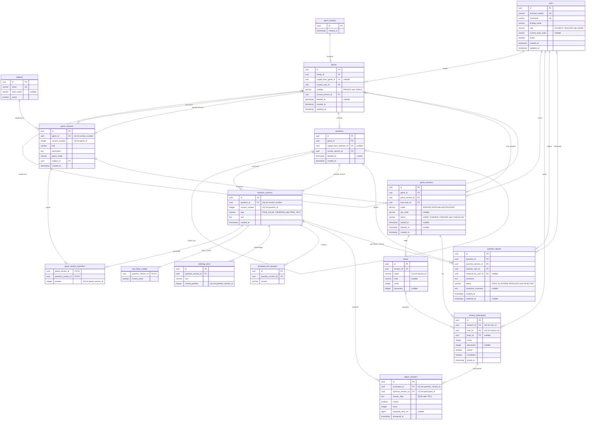

```mermaid
erDiagram

    users {
        uuid id PK
        varchar external_subject UK
        varchar username UK
        varchar display_name
        varchar role "STUDENT, TEACHER oder ADMIN"
        varchar current_class_code "nullable"
        boolean active
        timestamp created_at
        timestamp updated_at
    }

    subjects {
        uuid id PK
        varchar name UK
        varchar short_name "nullable"
        boolean active
    }

    game_families {
        uuid id PK
        timestamp created_at
    }

    games {
        uuid id PK
        uuid family_id FK
        uuid copied_from_game_id FK "nullable"
        uuid creator_user_id FK
        varchar visibility "PRIVATE oder PUBLIC"
        uuid current_version_id FK
        timestamp deleted_at "nullable"
        timestamp created_at
        timestamp updated_at
    }

    game_versions {
        uuid id PK
        uuid game_id FK "UQ mit version_number"
        integer version_number "UQ mit game_id"
        varchar title
        text description
        varchar game_mode
        uuid subject_id FK
        timestamp created_at
    }

    questions {
        uuid id PK
        uuid game_id FK
        uuid copied_from_question_id FK "nullable"
        uuid current_version_id FK
        timestamp deleted_at "nullable"
        timestamp created_at
    }

    question_versions {
        uuid id PK
        uuid question_id FK "UQ mit version_number"
        integer version_number "UQ mit question_id"
        varchar type "TRUE_FALSE, ORDERING oder FREE_TEXT"
        text text
        timestamp created_at
    }

    game_version_questions {
        uuid game_version_id PK, FK
        uuid question_version_id PK, FK
        integer position "UQ mit game_version_id"
    }

    true_false_configs {
        uuid question_version_id PK, FK
        boolean correct_value
    }

    ordering_items {
        uuid id PK
        uuid question_version_id FK
        varchar text
        integer correct_position "UQ mit question_version_id"
    }

    accepted_text_answers {
        uuid id PK
        uuid question_version_id FK
        varchar answer
    }

    game_sessions {
        uuid id PK
        uuid game_id FK
        uuid game_version_id FK
        uuid host_user_id FK
        varchar mode "SINGLEPLAYER oder MULTIPLAYER"
        varchar join_code "nullable"
        varchar status "LOBBY, RUNNING, FINISHED oder CANCELLED"
        timestamp started_at "nullable"
        timestamp finished_at "nullable"
        timestamp created_at
    }

    teams {
        uuid id PK
        uuid session_id FK
        varchar name "UQ mit session_id"
        varchar color "nullable"
        integer score
        integer placement "nullable"
    }

    session_participants {
        uuid id PK
        uuid session_id FK "UQ mit user_id"
        uuid user_id FK "UQ mit session_id"
        uuid team_id FK "nullable"
        integer score
        integer placement "nullable"
        boolean winner
        boolean completed
        timestamp joined_at
    }

    player_answers {
        uuid id PK
        uuid participant_id FK "UQ mit question_version_id"
        uuid question_version_id FK "UQ mit participant_id"
        text answer_data "JSON oder TEXT"
        boolean correct
        integer score
        bigint response_time_ms "nullable"
        timestamp answered_at
    }

    question_reports {
        uuid id PK
        uuid question_id FK
        uuid question_version_id FK
        uuid reporter_user_id FK
        uuid resolved_by_user_id FK "nullable"
        text comment
        varchar status "OPEN, IN_REVIEW, RESOLVED oder REJECTED"
        text resolution_comment "nullable"
        timestamp created_at
        timestamp resolved_at "nullable"
    }


    users ||--o{ games : erstellt

    subjects ||--o{ game_versions : kategorisiert

    game_families ||--|{ games : gruppiert

    games |o--o{ games : "kopiert von"

    games ||--|{ game_versions : versioniert

    games |o--|| game_versions : "aktuelle Version"


    games ||--o{ questions : enthaelt

    questions |o--o{ questions : "kopiert von"

    questions ||--|{ question_versions : versioniert

    questions |o--|| question_versions : "aktuelle Version"

    game_versions ||--|{ game_version_questions : ordnet

    question_versions ||--o{ game_version_questions : verwendet

    question_versions ||--o| true_false_configs : Wahr_Falsch

    question_versions ||--o{ ordering_items : Reihenfolge

    question_versions ||--o{ accepted_text_answers : Freitext


    games ||--o{ game_sessions : wird_gespielt

    game_versions ||--o{ game_sessions : Snapshot

    users ||--o{ game_sessions : hostet

    game_sessions ||--o{ teams : bildet

    game_sessions ||--o{ session_participants : hat

    users ||--o{ session_participants : spielt

    teams |o--o{ session_participants : gruppiert

    session_participants ||--o{ player_answers : beantwortet

    question_versions ||--o{ player_answers : bewertet


    questions ||--o{ question_reports : betrifft

    question_versions ||--o{ question_reports : gemeldete_Version

    users ||--o{ question_reports : meldet

    users |o--o{ question_reports : bearbeitet
```