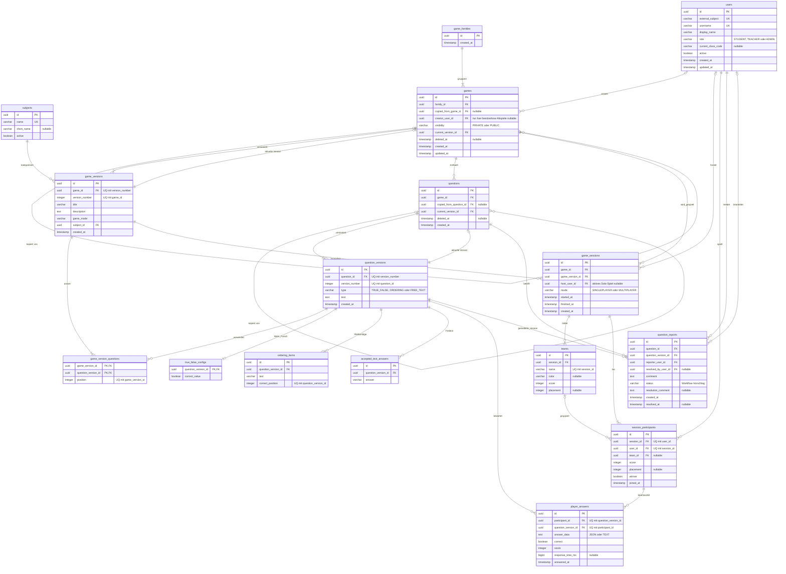

# Datenmodell Version 1 – Mermaid-Entwurf

Stand: 30. September 2026. Fachlicher Entwurf, keine bereits implementierte
Datenbank. Die Tabellen zu Sessions, Teams, Teilnehmern und Antworten zeigen
ausschließlich dauerhaft gespeicherte, vollständig abgeschlossene Runden.
Lobby, laufende und abgebrochene Runden haben hier keinen Datensatz.

Modellannahme: Beim aktiven Solo-Spiel ist `host_user_id` leer; die allein spielende
Person steht als Teilnehmer in `session_participants`. In einer gehosteten
Mehrspieler-Runde darf der Host nicht zugleich Teilnehmer sein. Nur aktive
Teilnehmer erhalten Fortschritt: Schüler, Lehrkräfte im Singleplayer und
mitspielende Administratoren. Alle Teilnehmer einer abgeschlossenen Runde
erhalten Punkte; Plätze 1 bis 3 deutlich mehr. Punkteformel und Bonus bei einem
Gleichstand an der Grenze zu Platz 3 sind offen. Ein Lobbycode gehört nur zum
flüchtigen Rundenzustand. Ob Lehrkräfte im Mehrspieler-Modus aktiv teilnehmen
dürfen, ist weiterhin offen. Ebenso offen ist, ob ein privates Spiel ohne
Mitspieler gehostet und als Runde abgeschlossen werden kann. Das gezeigte
Ergebnismodell setzt mindestens einen aktiven Teilnehmer voraus; der Host
würde auch in einer reinen Host-Runde nicht selbst mitspielen.

Neue Spiele sind standardmäßig privat. Vorhandene Spiele werden bei der
Migration öffentlich, auch wenn `creator_user_id` mangels belegbarem Ersteller
leer bleibt. Die feste Prüfung der drei Schul-Keycloak-IT-Benutzernamen
`it220269`, `it220240` und `it220265` für `ADMIN` ist geplant; das genaue
Token-Feld ist technisch noch zu verifizieren. Es gibt keine separate
Admin-Anmeldung oder Datenbankvergabe.

Die Sichtbarkeit von Meldungsdetails ist offen. Bestätigt ist nur, dass
Ersteller und Administratoren die Frage ändern dürfen. Status,
Bearbeitungsweg und Empfänger der Meldung sind Vorschläge. Beim Löschen einer
gemeldeten Frage wird auch ihre Meldung gelöscht; wie dabei historische
Antworten trotz `question_versions.question_id` erhalten bleiben, ist technisch
noch zu klären. `questions.deleted_at` ist dafür nur ein Modellvorschlag.
